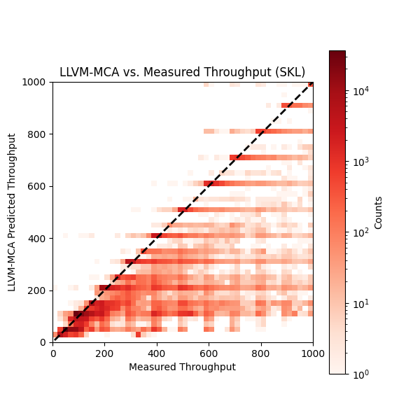

## Training Setup

## Train From Dataset With Tokenizer

### Build DynamoRIO
```
git clone https://github.com/ithemal/Ithemal.git
git clone https://github.com/ithemal/bhive.git
cd Ithemal/data_collection
## Build DynamoRIO for tokenizer
git clone --recurse-submodules -j4 https://github.com/DynamoRIO/dynamorio.git
cd dynamorio && mkdir build && cd build
cmake ..
make -j
```

### Build Ithemal Tokenizer
```
cd Ithemal/data_collection
mkdir build && cd build
cmake -DDynamoRIO_DIR=/path/to/dynamorio/build/cmake ..
make -j
```

### train
```
mkdir -p ./my_models
ITHEMAL_TARGET=skl ITHEMAL_HOME=./Ithemal python3 train.py --epochs 200 --batch-size 512 --validation-split 0.15 --save-path ./my_models --num-workers=4 --load-model ./my_models/ithemal_bhive_skl_best.pt --save-interval 20
```


## Train From Deserialized dataset

If you happend to obtain [`dataset_dump_skl.pkl`](https://uofi.box.com/s/05r8ek8wjaw81mr07xriemskk9qktzhj), where we cached the tokenizers, you can train with possibly lower CPU pressure, and no need to compile tokenizer.
```
ITHEMAL_TARGET=skl ITHEMAL_HOME=./Ithemal python3 train.py --epochs 200 --batch-size 512 --validation-split 0.15 --save-path ./my_models --num-workers=4 --load-model ./my_models/ithemal_bhive_skl_best.pt --save-interval 20 --deserialize
```

## Results




